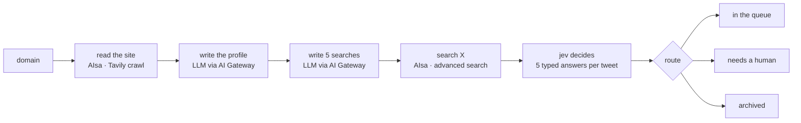

# Worth Replying

**Give it a domain.** It reads your site, works out who you are for, then reads X and comes back with the conversations worth answering.

No keywords, no forms, nothing to set up. Every call on every tweet is made by [jev](https://typesafe.ai/blog/introducing-system-one-models-and-jev) — TypeSafe's System One model — which answers five typed questions in one request, each with a calibrated probability, in a few hundred milliseconds. Values, never sentences.

[](https://vercel.com/new/clone?repository-url=https%3A%2F%2Fgithub.com%2FAIsa-team%2Fworth-replying&env=AISA_API_KEY&envDescription=AIsa%20reads%20the%20site%20and%20searches%20X.%20The%20AI%20Gateway%20needs%20no%20key%20on%20Vercel.&envLink=https%3A%2F%2Fgithub.com%2FAIsa-team%2Fworth-replying%23environment-variables&project-name=worth-replying&repository-name=worth-replying)

> **Built on [AIsa](https://aisa.one)** — the unified resource and transaction network for AI agents. Everything this app knows about the outside world — the website it reads, the tweets it searches — comes through one AIsa key. [More below ↓](#about-aisa)

## How it works



1. **Domain** — type one in.
2. **Profile** — the site is crawled a few pages deep, and a language model writes down what you do, who buys it, what hurts them, and who else they would consider. From that profile it writes five X searches, then runs one page of each to measure how much each one actually returns. You watch all of this happen: pages land, the profile types itself out, the searches follow.
3. **Run** — every search is paged through in parallel. Each new tweet goes to jev, eight at a time, and the console fills in live: the tweet being decided, the five answers against their thresholds, where it was routed, and what it has cost so far.

4. **Review** — everything jev did not archive, best opening first, with its five answers. Each one has a **Reply on X** button that opens X's composer already addressed to that tweet, and a link to the tweet itself. You can step here while the run is still going: the run carries on and the list keeps growing. You write the reply; you send it.

Step 5 of the design (**Sent**) is not built, and drafting replies is deliberately left out. Nothing is ever posted.

### The five questions

jev is asked these about every tweet, in a single request:

| Answer | Type | What it is for |
| --- | --- | --- |
| **Is ICP** | boolean | Is the author a plausible buyer? Shown, not required. |
| **Pain** | choice | Which of the profile's pains the tweet expresses, or `none`. |
| **Reply value** | score 0–3 | Is a reply worthwhile — to help the author, *or* to be seen in a conversation your audience is reading? This alone decides whether a tweet is worth answering. |
| **Needs human** | boolean | Large account, heated thread, anything where a clumsy reply costs reputation. Sends the tweet to a person instead of the queue. |
| **Injection** | boolean | Does the tweet contain instructions aimed at an AI reading it? Such tweets are never queued. |

The thresholds live in [`lib/decision.ts`](lib/decision.ts) and are shared by the server, which routes on them, and the console, which draws them as the tick on each track. The rubric and the wording of each question are in [`lib/server/jev.ts`](lib/server/jev.ts).

## About AIsa

[**AIsa**](https://aisa.one) is the unified resource and transaction network for AI agents: one account and one key for discovering, calling, and paying for models, APIs, real-time data, and tools — 950+ APIs behind a single surface, billed per call.

This project is a small, complete example of what that buys you. It needs two very different kinds of data — a crawl of an arbitrary website, and a live search of X — which would normally mean two providers, two keys, two billing relationships and two sets of quirks. Here it is one client in [`lib/server/aisa.ts`](lib/server/aisa.ts), about two hundred lines:

| What the app needs | AIsa endpoint | |
| --- | --- | --- |
| Read a company's site | `POST /tavily/crawl`, `/tavily/extract` | pages as clean markdown |
| Find the conversations | `GET /twitter/tweet/advanced_search` | tweets with authors, newest first |
| Know what it cost | every response | the real charge, in the `x-aisa-customer-cost-micros-usd` header |

That last row is why the running ledger and the daily budget in this app are exact rather than estimated: every AIsa response says what it cost.

The same key reaches a lot more than this demo uses:

- **Models** — an OpenAI-compatible gateway to the major model families.
- **Data APIs** — web and news search, X/Twitter, Reddit, YouTube, company and people data, financial and market data, academic search, prediction markets.
- **MCP** — one endpoint, `https://mcp.aisa.one/mcp`, puts the whole catalogue in front of an agent, with the price of each call available before it is made. The `gtm` module is the go-to-market set: people and company search, creator discovery, and social listening — the natural next step for a tool like this one.
- **Machine payments** — agents can discover and pay for capabilities programmatically, including pay-per-call over x402.

Start here: [aisa.one](https://aisa.one) · [Docs](https://aisa.one/docs) · [API reference](https://aisa.one/docs/api-reference) · [MCP catalogue](https://mcp.aisa.one/servers)

## Quick start

Requires **Node 22+** and **pnpm**.

```bash
git clone https://github.com/AIsa-team/worth-replying.git
cd worth-replying
pnpm install
cp .env.example .env   # then fill in the two keys
pnpm dev
```

Open <http://localhost:3000>. For a cheap first run, add `?target=40` to the run page URL — it reads 40 tweets instead of 1,000.

## Environment variables

| Variable | Required | Default | |
| --- | --- | --- | --- |
| `AISA_API_KEY` | yes | — | [AIsa](https://aisa.one) key: reads the website and searches X. Sign up at [aisa.one](https://aisa.one). |
| `AI_GATEWAY_API_KEY` | locally | — | [Vercel AI Gateway](https://vercel.com/docs/ai-gateway) key: the language model and jev. On Vercel it is not needed — deployments authenticate to the gateway by OIDC. |
| `LLM_MODEL` | no | `anthropic/claude-sonnet-5` | Writes the profile and the searches. Any gateway language model id. |
| `JEV_MODEL` | no | `typesafe-ai/jev` | Scores each tweet. |
| `RUN_TWEET_TARGET` | no | `1000` | Tweets one run reads. |
| `DAILY_BUDGET_USD` | no | `5` | Stops new paid work once the day's spend passes this. See the caveat below. |

## Deploy to Vercel

Use the button at the top, or:

```bash
vercel link
vercel env add AISA_API_KEY
vercel deploy --prod
```

Only `AISA_API_KEY` has to be set. The AI SDK picks up the deployment's OIDC token for the AI Gateway on its own; make sure AI Gateway is enabled for your team. The run endpoint streams for up to five minutes (`maxDuration = 300`), which fits within Vercel's limits with Fluid Compute, on by default for new projects.

## What a run costs

Two services bill per call, and **the figures on screen show only one of them**. The console and the profile page price a run by its model calls — the profile, the searches, and jev. The data calls to AIsa are counted toward the daily budget but are not part of the printed numbers.

Measured, for a 1,000-tweet run:

| | Roughly |
| --- | --- |
| Site crawl (AIsa) | $0.03 |
| Profile and searches (LLM) | $0.03 |
| Volume samples, 5 pages (AIsa) | $0.03 |
| Tweet search, ~50 pages (AIsa) | $0.26 |
| jev, 1,000 tweets × 5 answers | $0.04 |
| **Total** | **≈ $0.40**, of which about $0.07 is shown on screen |

The site read and the search plan are cached per domain for a day, so a second run on the same domain pays only for search and jev. Narrow topics often have fewer than 1,000 matching tweets in a week; the run then ends early and says so.

## Before you put it on the internet

This is a demo, and it spends money when someone opens a page.

- **There is no authentication and no rate limiting.** Anyone who can reach the deployment can start runs on your keys. Put it behind [Vercel Deployment Protection](https://vercel.com/docs/deployment-protection), your own auth, or keep it local.
- **Opening `/run` starts a run.** So does reloading it. Moving between the run and review screens does not; the run in progress is shared.
- **The daily budget is a guard rail, not a hard limit.** It is held in process memory: exact under `pnpm dev` or a single `next start`, but per instance on serverless. Set real spend limits on your AIsa and AI Gateway keys as well.
- **Tweet text is untrusted input.** It is only ever passed to jev as state to be scored; jev returns typed values and cannot be talked into doing anything. The website text goes to a language model with instructions to treat it as material, never as instructions.

## API

All endpoints take and return JSON. The two streaming ones return newline-delimited JSON, one event per line.

| Endpoint | |
| --- | --- |
| `POST /api/profile` | `{ domain }` → `{ read, plan, spentToday }`. Reads the site and writes the searches. Cached per domain. |
| `POST /api/profile/stream` | `{ domain }` → NDJSON `ProfileEvent`s: pages read, the profile and queries as they are written, each query's measured volume, then the final `read` and `plan`. |
| `POST /api/queries` | `{ profile }` → `SearchPlan`. Rewrites the searches from an edited profile. Never cached. |
| `POST /api/run` | `{ domain, target?, profile?, queries? }` → NDJSON `RunEvent`s: `start`, `search`, `decision`, `skipped`, then `done` or `error`. Closing the connection stops the run. |

```bash
curl -N -X POST http://localhost:3000/api/run \
  -H 'Content-Type: application/json' \
  -d '{"domain":"typesafe.ai","target":20}'
```

Event and payload types are in [`lib/run-types.ts`](lib/run-types.ts).

## Project layout

```
app/
  page.tsx                  1 — domain
  profile/                  2 — profile and searches, streamed in
  run/                      3 — the live console
  review/                   4 — the conversations worth answering, with links to X
  api/                      profile, profile/stream, queries, run
components/
  profile-live.tsx          follows /api/profile/stream
  run-console.tsx           draws one frame of the run
  review-list.tsx           the review screen
  use-run.ts                paints the current run at a steady rate
lib/
  decision.ts               thresholds and routing — shared by server and UI
  run-frame.ts              events → state → the strings the console prints
  run-store.ts              the run in progress, shared by the run and review screens
  run-types.ts              every shape that crosses the wire
  server/
    aisa.ts                 AIsa client: crawl, extract, X search; real cost per call
    llm.ts                  site → profile, profile → searches (streamed structured output)
    jev.ts                  the five questions, with a deadline and retry per call
    profile.ts              read + plan, cached and shared between screens
    progress.ts             side channel that lets a cached job report as it works
    run.ts                  search lanes feeding an 8-wide jev pool
    budget.ts               the daily spending ceiling
```

## Tuning

- **Too strict or too loose?** Move `val` in [`lib/decision.ts`](lib/decision.ts), or edit the reply-value rubric in [`lib/server/jev.ts`](lib/server/jev.ts). jev's answers follow the wording closely, so change the descriptions before changing the numbers.
- **Too few tweets?** The shared filter in [`lib/server/profile.ts`](lib/server/profile.ts) is `-filter:replies min_faves:2 lang:en` over the last 7 days. Relaxing `min_faves` or widening the window raises volume; so does the query-writing prompt in [`lib/server/llm.ts`](lib/server/llm.ts).
- **Different models?** `LLM_MODEL` takes any AI Gateway language model id; `JEV_MODEL` takes any evaluation model id the gateway offers.

## Built with

[Next.js 16](https://nextjs.org) · [AI SDK 7](https://ai-sdk.dev) (`streamText` with structured output, `experimental_evaluate`) · [Vercel AI Gateway](https://vercel.com/docs/ai-gateway) · [jev](https://typesafe.ai) by TypeSafe · [AIsa](https://aisa.one) data APIs · Tailwind CSS 4 · shadcn/ui

## Contributing

Issues and pull requests are welcome. `pnpm build` type-checks the project; please make sure it passes. If you are changing how tweets are judged, include a few before-and-after examples — the prompts are the product here.

## License

[MIT](LICENSE) — made by the team at [AIsa](https://aisa.one).
